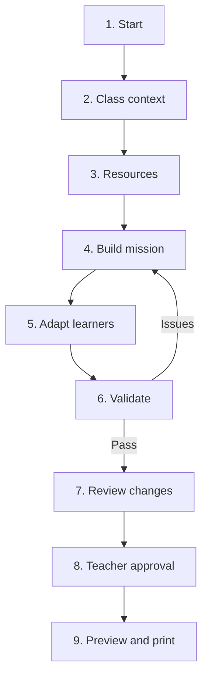
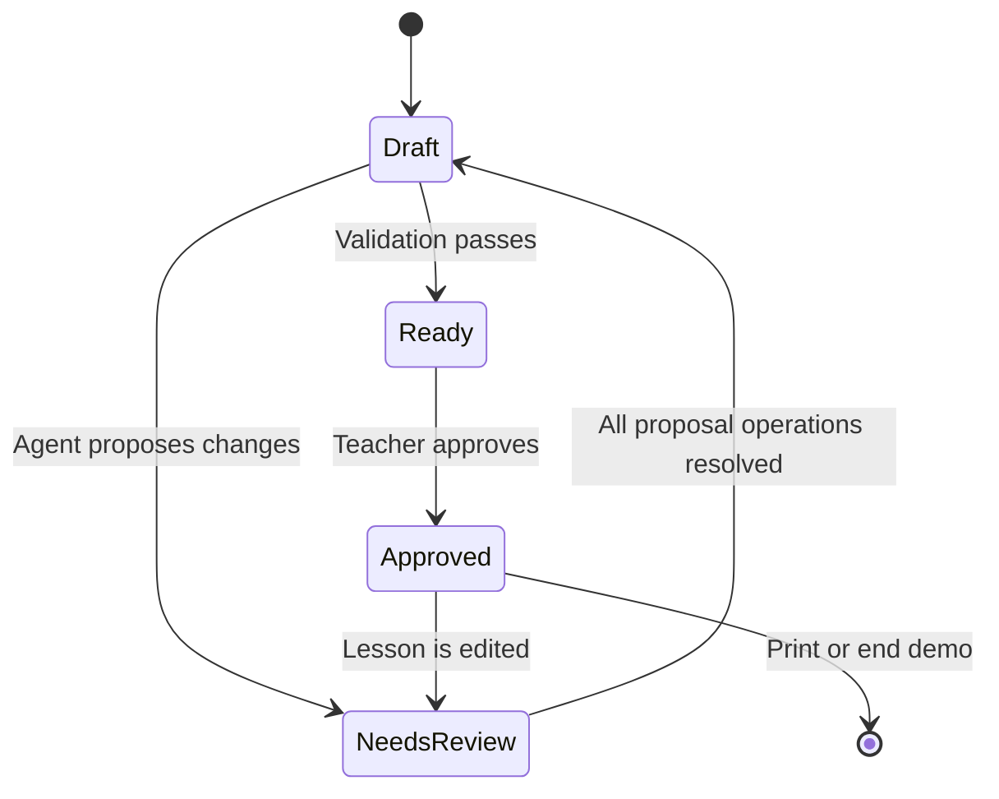

# Tangible Coding Studio WebMCP Prototype

## Formal Product, Interaction and Build Specification — v1.0

## 1. Document purpose

This specification defines the competition prototype for **Tangible Coding Studio: Mission Builder**. It is intended to be sufficiently precise for implementation by Codex or a web-development team without expanding the prototype into the full commercial Tangible Coding Studio.

The prototype demonstrates one complete human–agent workflow:

> A Scottish primary teacher and an AI agent jointly create, adapt, validate and approve a screen-light tangible coding lesson on the same visual lesson canvas by using structured WebMCP tools.

## 2. Product decision

### 2.1 Approved prototype

**Product name:** Tangible Coding Studio  
**Prototype name:** Mission Builder  
**Tagline:** *Design a teachable tangible coding mission with your AI partner.*

### 2.2 Product role

The prototype is a **teacher-facing backstage planning tool**. It is not pupil-facing software and is not the full Tangible Coding Studio MVP.

### 2.3 Competition claim

The prototype will demonstrate that WebMCP turns a lesson-design website from a form that an agent must visually navigate into a structured collaborative environment in which:

- the teacher remains in control of the visible lesson canvas;
- the agent reads and changes defined lesson state through tools;
- changes are visible, attributable and reviewable;
- physical resource constraints affect the lesson design;
- the lesson must pass deterministic checks before teacher approval.

## 3. Scope

### 3.1 In scope

- One responsive desktop-first web application.
- One anonymous demonstration workspace; no production account system.
- One primary teacher persona.
- One lesson-design workflow.
- Class context and tangible-resource configuration.
- Tangible Learning Cycle structure:
  - Plan;
  - Build & Explain;
  - Test & Debug;
  - Reflect & Improve.
- Five imperative WebMCP tools.
- One shared visual lesson canvas.
- Learner-support and extension adaptations.
- Deterministic lesson validation.
- Teacher review, approve and reopen actions.
- Printable browser view for three output documents.
- Local/browser persistence for the current demo lesson.
- Agent activity log and visible pending changes.
- Sample data suitable for an English-language competition demo.

### 3.2 Out of scope

- Pupil accounts or pupil-facing screens.
- Real school, teacher or child data.
- School administration and multi-school dashboards.
- Subscription, payment or licensing workflows.
- Full P1–P7 curriculum library.
- Full CfE database or authoritative curriculum certification.
- Automated marking or pupil progress history.
- Complex analytics.
- Direct RoBico hardware connectivity.
- Full PDF-generation service.
- Production authentication, role-based permissions or cloud database.
- Integration with Microsoft 365, Google Classroom or school MIS.
- Publishing proprietary curriculum packs.
- Autonomous final approval by the agent.

## 4. Primary user and scenario

### 4.1 Persona

**Name:** Sarah  
**Role:** P4 class teacher in a Scottish primary school  
**Computing confidence:** Beginner  
**Class:** 24 pupils  
**Available time:** 45 minutes  
**Resources:** 3 robots, 9 tile sets, 3 activity mats, 3 instruction-card packs  
**Goal:** Teach debugging through a literacy/storytelling mission  
**Learner need:** Reduced reading load and visual instructions  
**Extension need:** A more complex challenge for confident learners

### 4.2 Golden-path prompt

> Create a 45-minute P4 storytelling mission for 24 pupils. We have three robots, nine tile sets, three activity mats and three instruction-card packs. Focus on debugging. Use reduced reading and visual instructions, then add a loop challenge for confident learners. Validate the lesson and prepare it for my review.

### 4.3 Golden-path outcome

The teacher receives a complete, feasible lesson containing:

- learning intention;
- observable success criteria;
- story mission;
- class grouping and equipment allocation;
- four-stage Tangible Learning Cycle;
- learner support;
- extension challenge;
- assessment evidence;
- teacher guide;
- pupil mission card;
- observation checklist.

The teacher reviews all proposed changes and makes the final approval.

## 5. Success criteria

The prototype succeeds when all of the following are true:

1. It is accessible through a public live URL.
2. A compatible browser agent can discover all registered WebMCP tools.
3. The golden-path prompt can populate the class and resource context.
4. The agent can construct a mission by updating the visible page state.
5. The agent can adapt one existing mission section without replacing the whole lesson.
6. Validation detects at least four meaningful feasibility or completeness failures.
7. The teacher can see what changed and approve or reject pending changes.
8. The agent cannot approve the lesson.
9. The approved lesson has a readable print view.
10. The complete workflow can be demonstrated clearly in less than three minutes.

## 6. Information architecture

The application contains one route for the competition build:

```text
/
└── Mission Builder
    ├── Header and lesson status
    ├── Step navigation
    ├── Teacher Context panel
    ├── Lesson Canvas
    ├── Agent Activity panel
    ├── Validation panel
    └── Output preview
```

Optional utility routes:

```text
/about       Short project and WebMCP explanation
/privacy     Demo privacy statement
/print       Printable approved lesson
```

## 7. Overall workflow



## 8. Global interface design

### 8.1 Desktop layout

The primary layout uses three columns beneath a fixed header:

| Area | Width | Purpose |
|---|---:|---|
| Left panel | 280–320 px | Current step, teacher inputs and resource settings |
| Centre canvas | Flexible, minimum 600 px | Visible lesson document and editable sections |
| Right panel | 320–360 px | Agent activity, pending changes and validation |

### 8.2 Header

The header must contain:

- Tangible Coding Studio wordmark;
- prototype label: `WebMCP Mission Builder`;
- lesson title;
- status badge: `Draft`, `Needs review`, `Ready`, `Approved`;
- `Reset demo` action;
- `Preview outputs` action, disabled until validation passes;
- small `WebMCP connected` indicator based on feature detection.

### 8.3 Step navigation

Display a nine-step vertical navigation in the left panel:

1. Start
2. Class
3. Resources
4. Mission
5. Adapt
6. Validate
7. Review
8. Approve
9. Output

Completed steps show a tick. The current step uses Scotland blue. Steps with unresolved errors use amber. Approval uses green.

### 8.4 Visual language

- **Primary colour:** Scotland blue.
- **Accent colour:** Tangible Coding Tiffany blue.
- **Canvas background:** warm off-white, resembling a teacher planning sheet.
- **Cards:** white with subtle border and 8–12 px radius.
- **Status colours:** blue = information; amber = review; red = blocking issue; green = approved.
- **Typography:** clear sans-serif suitable for school staff; minimum 16 px body text.
- **Icons:** simple line icons; do not use unlicensed RoBico artwork.
- **Accessibility:** keyboard-operable controls, visible focus, labelled form controls, colour-independent status labels and WCAG-AA contrast target.

## 9. Step-by-step interaction and design specification

## Step 1 — Start

### Objective

Explain the prototype and let the teacher begin from a safe sample workspace.

### Screen design

Centre the following in the lesson canvas:

- Heading: `Build a tangible coding mission with your AI partner`.
- Three short value cards:
  - Match the lesson to your class;
  - Work within your available equipment;
  - Review every agent change before approval.
- Primary button: `Start a new mission`.
- Secondary button: `Load the P4 demo`.
- A privacy note: `Use sample information only. Do not enter pupil names or personal data.`

Right panel shows an explanation of WebMCP:

> This page provides structured tools that a compatible agent can use. All proposed changes remain visible and require teacher review.

### Actions

- `Start a new mission` creates a blank `LessonDraft`.
- `Load the P4 demo` preloads the competition scenario but does not build the mission.
- The system assigns a local draft ID and status `Draft`.

### Completion condition

A valid draft exists and the teacher proceeds to Step 2.

## Step 2 — Define class context

### Objective

Capture the minimum context required to design a feasible lesson.

### Left-panel controls

| Field | Control | Required | Values/default |
|---|---|---:|---|
| Primary stage | Select | Yes | P1–P7; default P4 |
| Class size | Number | Yes | 1–40; default 24 |
| Duration | Select | Yes | 30, 45, 60, 90 minutes; default 45 |
| Learning focus | Multi-select | Yes | Sequencing, algorithms, loops, debugging, conditionals, collaboration |
| Subject context | Select | Yes | Computing, literacy, maths, STEM, IDL |
| Teacher confidence | Select | Yes | Beginner, developing, confident |
| Free-text goal | Text area | No | Maximum 280 characters |

### Centre canvas behaviour

Show a `Class brief` card containing the current structured context. Each change updates the card immediately.

### Right-panel behaviour

Record either:

- `Teacher updated class context`, or
- `Agent called set_class_context`.

Agent-originated changes appear as pending until the teacher accepts them. Teacher-entered changes are immediately accepted.

### WebMCP tool

`set_class_context`

### Validation

- Class size must be 1–40.
- At least one learning focus is required.
- Duration and primary stage are required.
- No personal names or pupil-level data fields are available.

### Completion condition

All required class-context fields are valid.

## Step 3 — Define tangible resources

### Objective

Ensure the lesson is constrained by equipment genuinely available to the class.

### Left-panel controls

Resource rows use a stepper and a simple generic icon:

| Resource | Range | Demo default |
|---|---:|---:|
| Robots | 0–12 | 3 |
| Tile sets | 0–30 | 9 |
| Activity mats | 0–12 | 3 |
| Instruction-card packs | 0–12 | 3 |
| Pupil role cards | 0–40 | 24 |

Include checkbox: `Allow tile-only groups without a robot` — default enabled.

### Centre canvas behaviour

Show a live `Resource plan` summary:

- available equipment;
- suggested number of groups;
- pupils per group;
- rotation requirement;
- any resource shortage.

### Grouping calculation

Maximum group size is eight pupils. A basic group station requires three tile sets and one instruction-card pack. A robot-active station additionally requires one robot and one activity mat. When tile-only groups are enabled, a basic station may operate without a robot or activity mat. When tile-only groups are disabled, every simultaneous station requires both one robot and one activity mat. Role cards support pupil roles but do not determine station capacity.

```text
requiredGroups = pupils <= 0 ? 0 : ceil(pupils / 8)
baseStationCapacity = min(floor(tileSets / 3), instructionCardPacks)
robotStationCapacity = min(robotCount, activityMatCount, baseStationCapacity)
simultaneousCapacity = tileOnlyEnabled ? baseStationCapacity : robotStationCapacity
rotationRequired = simultaneousCapacity > 0 and requiredGroups > simultaneousCapacity
blocking = requiredGroups > 0 and simultaneousCapacity = 0
```

The visible suggested group count is `requiredGroups`, and pupils per group is `ceil(pupils / requiredGroups)` when at least one group is required. Rotation provides the participation route when simultaneous capacity is positive but below the required group count. This formula supersedes the earlier ambiguous `max(robotCount, activityMatCount)` rule.

### WebMCP tool

`select_tangible_resources`

### Blocking states

- No resources selected.
- Zero robots and tile-only groups disabled.
- Fewer usable stations than required without a rotation plan.

### Completion condition

A feasible initial group structure can be calculated or a visible warning is acknowledged for later resolution.

## Step 4 — Build the mission

### Objective

Create the central teaching experience using the Tangible Learning Cycle.

### Left-panel controls

- Mission theme.
- Challenge level: introductory, core, stretch.
- Starting method:
  - agent proposes a mission;
  - teacher starts from a blank structure;
  - load sample mission.
- Primary button: `Build mission`.

Each Tangible Learning Cycle stage has an explicit `durationMinutes` control. Values must be positive integers and the four stage durations must sum exactly to the lesson duration. Timing is never inferred from prose length.

### Centre lesson canvas

The canvas contains editable cards in this order:

1. **Lesson identity**
   - title;
   - stage;
   - duration;
   - subject context.
2. **Learning intention**
3. **Success criteria** — two to four observable statements.
4. **Mission story/problem**
5. **Plan**
6. **Build & Explain**
7. **Test & Debug**
8. **Reflect & Improve**
9. **Group and equipment plan**
10. **Assessment evidence**

Every card supports:

- inline teacher edit;
- status marker: unchanged, proposed, teacher-edited, accepted;
- `Accept change` and `Revert` when the agent changed it;
- character guidance, not a hard restriction except where necessary.

### Right-panel behaviour

Show a grouped change set rather than dozens of isolated events:

```text
Agent proposed Mission v1
• Added learning intention
• Added 3 success criteria
• Built four Tangible Learning Cycle stages
• Proposed 3-group rotation
[Review changes]
```

### WebMCP tool

`build_tangible_mission`

### Tool rule

The tool must update structured lesson state and the visible canvas. It must not return only a prose lesson to the agent.

### Completion condition

All ten canvas cards exist and contain draft content.

## Step 5 — Adapt for learners

### Objective

Modify the existing mission for access and challenge without regenerating the entire lesson.

### Left-panel controls

Support checkboxes:

- reduced reading load;
- visual instructions;
- fewer algorithm steps;
- additional processing time;
- paired explanation;
- predictable role sequence.

Extension checkboxes:

- longer route;
- extra debugging fault;
- loop challenge;
- explain two solutions;
- design a new mission.

Structured instruction fields:

- `Support instructions` — maximum 500 characters;
- `Extension instructions` — maximum 500 characters.

Both fields use fictional class-level information only and must not contain personal pupil information.

Include checkbox: `No additional adaptation for this demo`. This is an explicit teacher decision. Selecting it clears support and extension selections and instructions. The controls remain available; entering either instruction field or selecting any support or extension clears the explicit-decline state.

Manual Step 5 records teacher decisions in the adaptation plan only. It does not rewrite Step 4 mission prose and leaves `sectionsToUpdate` empty. That field is reserved for later WebMCP and change-control proposals.

### Centre canvas behaviour

Add two new cards:

- `Access and support`;
- `Extension challenge`.

Highlight only the lesson sections changed by adaptation. Existing accepted content must remain unchanged unless required by the selected adaptations.

### Right-panel behaviour

Display a before/after comparison for each changed section. Teacher can accept changes individually or select `Accept adaptation set`.

### WebMCP tool

`adapt_for_learners`

### Completion condition

At least one non-empty support or extension instruction is recorded, or the teacher explicitly selects `No additional adaptation for this demo`. Selected checkboxes without corresponding instructions remain visibly incomplete.

## Step 6 — Validate lesson

### Objective

Run deterministic checks to establish whether the lesson is complete and physically teachable.

### Validation categories

| Category | Example checks |
|---|---|
| Completeness | Learning intention, success criteria and all four cycle stages exist |
| Time | Estimated phase durations do not exceed lesson duration |
| Equipment | Group plan does not allocate unavailable resources |
| Participation | Every pupil has a group/role or rotation route |
| Pedagogy | Test & Debug and Reflect & Improve require observable pupil action |
| Assessment | Evidence is linked to at least one success criterion |
| Adaptation | Selected learner needs appear in the mission instructions |
| Safety/privacy | No pupil personal data is present in structured fields |

For this prototype, assessment validation checks only that assessment evidence is non-empty; it does not map evidence to individual success criteria. Beginner preparation guidance uses the existing Step 5 `supportInstructions` field. A selected support or extension without its corresponding non-empty instructions is an error.

The personal-data check is deliberately limited to ordinary email-address patterns, phone numbers introduced by `Phone:`, `Tel:` or `Mobile:`, clearly international `+number` forms, and names introduced by `Pupil name:` or `Student name:`. Matching is case-insensitive. Arbitrary names and number sequences are not scanned. This is a limited obvious-pattern check, not comprehensive safeguarding detection.

### Validation severity

- `Error`: blocks approval.
- `Warning`: requires teacher acknowledgement.
- `Pass`: requirement satisfied.

### Centre canvas behaviour

Cards with issues receive an anchored marker. Selecting an issue scrolls to the relevant card.

### Right-panel design

Display a validation summary:

```text
Lesson readiness: 6/8 checks passed
2 blocking issues
1 warning
```

Each issue includes:

- plain-language explanation;
- affected section;
- suggested fix;
- `Ask agent to fix` action;
- `Edit myself` action.

### WebMCP tool

`validate_and_prepare_lesson`

During the transport-independent change-control slice, the tool uses the same pure validator as Manual Step 6 and leaves `preparedOutputs` empty. Output preparation remains a later task, and the tool never approves the lesson.

### Completion condition

No blocking errors remain and all warnings are acknowledged or resolved.

Warnings are acknowledged individually by stable validation-rule ID and acknowledgements persist across reload. Editing Steps 1–5 invalidates the previous validation result and its acknowledgements. When there are no errors, all warnings are acknowledged and no pending changes exist, manual validation may move the lesson from `Draft` to `Ready`. `Ready` means ready for human teacher review, never approved. Validation leaves prepared outputs empty.

## Step 7 — Review agent changes

### Objective

Make agent contribution transparent before approval.

### Main design

Replace the normal centre canvas temporarily with a change-review view:

| Column | Content |
|---|---|
| Section | Lesson section affected |
| Before | Previous accepted value |
| Proposed | Current agent proposal |
| Source | Teacher or named WebMCP tool |
| Decision | Accept, edit, reject |

### Controls

- `Accept section`;
- `Edit and accept`;
- `Reject section`;
- `Return to canvas`;

### Rules

- Decisions are made section-by-section against the closed named-section catalogue in Section 13; arbitrary JSON paths are prohibited.
- Accepted lesson content remains unchanged until the teacher accepts an operation.
- Teacher edits supersede only overlapping operations when the current accepted section differs structurally from the recorded `before` value. Unrelated pending operations remain reviewable.
- `Edit and accept` preserves the original proposal and records the teacher-modified accepted value.
- Rejected and superseded operations do not change accepted content.
- Every decision receives a timestamp in the local activity log.
- The agent cannot invoke review decisions.
- Accepting, rejecting or superseding proposals cannot set `approvedAt`, approve the lesson or mark it ready.

### Completion condition

No pending agent change remains undecided.

## Step 8 — Teacher approval

### Objective

Create an explicit human decision boundary.

### Screen design

Show a compact approval summary:

- lesson title and stage;
- duration;
- class size;
- resource plan;
- validation result;
- number of teacher edits;
- number of accepted agent proposals;
- privacy reminder.

Required checkbox:

`I have reviewed this lesson and confirm that it is suitable for my demonstration class.`

Primary button:

`Approve lesson`

Secondary button:

`Return to editing`

### Permission rule

Approval must only be available through a human UI event. No WebMCP tool may approve, simulate approval or set `approvedAt`.

### State transition

```text
Ready → Approved
```

Any later lesson edit changes the state to:

```text
Approved → Needs review
```

### Completion condition

The teacher checks the confirmation and activates `Approve lesson`.

## Step 9 — Preview and print

### Objective

Demonstrate useful outputs without building a production document service.

### Output tabs

1. **Teacher Guide**
   - overview;
   - preparation;
   - timing;
   - facilitation notes;
   - differentiation;
   - assessment evidence.
2. **Pupil Mission Card**
   - mission story;
   - visual step sequence placeholders;
   - group roles;
   - success reminders.
3. **Observation Checklist**
   - observable success criteria;
   - evidence notes columns;
   - reflection prompts.

### Controls

- `Print current output` uses the browser print dialog.
- `Print all outputs` renders a combined print stylesheet.
- `Reopen lesson` returns the status to `Needs review`.
- `Start another demo` creates a new local draft after confirmation.

### Competition limitation

Do not claim that the browser print view is a finished commercial curriculum pack or production PDF export.

## 10. WebMCP tool specification

## 10.1 Tool: `set_class_context`

### Purpose

Create or update the structured teaching context.

### Input schema

```json
{
  "type": "object",
  "properties": {
    "stage": {"type": "string", "enum": ["P1", "P2", "P3", "P4", "P5", "P6", "P7"]},
    "classSize": {"type": "integer", "minimum": 1, "maximum": 40},
    "durationMinutes": {"type": "integer", "enum": [30, 45, 60, 90]},
    "learningFocus": {
      "type": "array",
      "items": {"type": "string", "enum": ["sequencing", "algorithms", "loops", "debugging", "conditionals", "collaboration"]},
      "minItems": 1
    },
    "subjectContext": {"type": "string", "enum": ["computing", "literacy", "maths", "STEM", "IDL"]},
    "teacherConfidence": {"type": "string", "enum": ["beginner", "developing", "confident"]},
    "goal": {"type": "string", "maxLength": 280}
  },
  "required": ["stage", "classSize", "durationMinutes", "learningFocus", "subjectContext", "teacherConfidence"]
}
```

### Output

Return the proposed normalized context, validation messages and change-set ID.

### Side effect

Update the Class Brief card and create pending changes for agent-originated values.

## 10.2 Tool: `select_tangible_resources`

### Input schema

```json
{
  "type": "object",
  "properties": {
    "robots": {"type": "integer", "minimum": 0, "maximum": 12},
    "tileSets": {"type": "integer", "minimum": 0, "maximum": 30},
    "activityMats": {"type": "integer", "minimum": 0, "maximum": 12},
    "instructionCardPacks": {"type": "integer", "minimum": 0, "maximum": 12},
    "roleCards": {"type": "integer", "minimum": 0, "maximum": 40},
    "allowTileOnlyGroups": {"type": "boolean"}
  },
  "required": ["robots", "tileSets", "activityMats", "instructionCardPacks", "allowTileOnlyGroups"]
}
```

### Output

Return normalized inventory, suggested grouping, resource warnings and change-set ID.

### Side effect

Update resource state and Resource Plan card.

## 10.3 Tool: `build_tangible_mission`

### Preconditions

- Valid class context exists.
- Resource state exists.

### Input schema

```json
{
  "type": "object",
  "properties": {
    "title": {"type": "string", "maxLength": 100},
    "theme": {"type": "string", "maxLength": 160},
    "challengeLevel": {"type": "string", "enum": ["introductory", "core", "stretch"]},
    "learningIntention": {"type": "string", "maxLength": 240},
    "successCriteria": {
      "type": "array",
      "items": {"type": "string", "maxLength": 180},
      "minItems": 2,
      "maxItems": 4
    },
    "missionStory": {"type": "string", "maxLength": 700},
    "plan": {"type": "string", "maxLength": 500},
    "planDurationMinutes": {"type": "integer", "minimum": 1},
    "buildAndExplain": {"type": "string", "maxLength": 500},
    "buildAndExplainDurationMinutes": {"type": "integer", "minimum": 1},
    "testAndDebug": {"type": "string", "maxLength": 500},
    "testAndDebugDurationMinutes": {"type": "integer", "minimum": 1},
    "reflectAndImprove": {"type": "string", "maxLength": 500},
    "reflectAndImproveDurationMinutes": {"type": "integer", "minimum": 1},
    "assessmentEvidence": {
      "type": "array",
      "items": {"type": "string", "maxLength": 180},
      "minItems": 1,
      "maxItems": 5
    }
  },
  "required": ["title", "theme", "challengeLevel", "learningIntention", "successCriteria", "missionStory", "plan", "planDurationMinutes", "buildAndExplain", "buildAndExplainDurationMinutes", "testAndDebug", "testAndDebugDurationMinutes", "reflectAndImprove", "reflectAndImproveDurationMinutes", "assessmentEvidence"]
}
```

### Output

Return mission version, affected section IDs, feasibility warnings and change-set ID.

### Side effect

Populate the lesson canvas as pending agent-proposed content.

## 10.4 Tool: `adapt_for_learners`

### Preconditions

A mission draft exists.

### Input schema

```json
{
  "type": "object",
  "properties": {
    "supports": {
      "type": "array",
      "items": {
        "type": "string",
        "enum": ["reduced-reading", "visual-instructions", "fewer-steps", "additional-time", "paired-explanation", "predictable-roles"]
      }
    },
    "extensions": {
      "type": "array",
      "items": {
        "type": "string",
        "enum": ["longer-route", "extra-debugging-fault", "loop-challenge", "compare-solutions", "design-new-mission"]
      }
    },
    "supportInstructions": {"type": "string", "maxLength": 500},
    "extensionInstructions": {"type": "string", "maxLength": 500},
    "sectionsToUpdate": {
      "type": "array",
      "items": {
        "type": "string",
        "enum": ["plan", "build-and-explain", "test-and-debug", "reflect-and-improve", "learner-support", "extension-challenge"]
      }
    }
  },
  "required": ["supports", "extensions", "supportInstructions", "extensionInstructions", "sectionsToUpdate"]
}
```

### Output

Return before/after values, affected sections and change-set ID.

### Side effect

Update only named sections and create a reviewable adaptation change set.

## 10.5 Tool: `validate_and_prepare_lesson`

### Input schema

```json
{
  "type": "object",
  "properties": {
    "runMode": {"type": "string", "enum": ["validate", "validate-and-prepare"]}
  },
  "required": ["runMode"]
}
```

### Output

```json
{
  "readiness": "blocked | warning | ready",
  "score": "number of passed checks",
  "checks": [],
  "preparedOutputs": []
}
```

### Side effect

Call the same pure deterministic validator as Manual Step 6 and update validation state directly. Validation results are derived state and do not become proposals. During this slice `preparedOutputs` remains empty: output preparation is not implemented. The tool must not accept content, mark a lesson approved or set `approvedAt`.

## 11. State model



## 12. Core data model

```ts
type LessonStatus = "draft" | "needs-review" | "ready" | "approved";

interface LessonDraft {
  id: string;
  title: string;
  status: LessonStatus;
  classContext: ClassContext;
  resources: ResourceInventory;
  groupingPlan: GroupingPlan;
  mission: MissionContent;
  adaptations: AdaptationPlan;
  validation: ValidationResult;
  pendingChanges: ChangeSet[];
  changeHistory: ChangeSet[];
  activityLog: ActivityEvent[];
  approvedAt?: string;
  createdAt: string;
  updatedAt: string;
}

// MissionContent stores planDurationMinutes, buildAndExplainDurationMinutes,
// testAndDebugDurationMinutes and reflectAndImproveDurationMinutes as explicit positive integers.

interface ClassContext {
  stage: "P1" | "P2" | "P3" | "P4" | "P5" | "P6" | "P7";
  classSize: number;
  durationMinutes: 30 | 45 | 60 | 90;
  learningFocus: string[];
  subjectContext: string;
  teacherConfidence: string;
  goal?: string;
}

interface ResourceInventory {
  robots: number;
  tileSets: number;
  activityMats: number;
  instructionCardPacks: number;
  roleCards: number;
  allowTileOnlyGroups: boolean;
}

type ApprovedToolName =
  | "set_class_context"
  | "select_tangible_resources"
  | "build_tangible_mission"
  | "adapt_for_learners"
  | "validate_and_prepare_lesson";

type LessonSectionId =
  | "class-context" | "tangible-resources" | "lesson-identity"
  | "learning-intention" | "success-criteria" | "mission-story"
  | "plan" | "build-and-explain" | "test-and-debug"
  | "reflect-and-improve" | "assessment-evidence"
  | "learner-support" | "extension-challenge";

interface ChangeOperation {
  operationId: string;
  section: LessonSectionId;
  before: unknown;
  proposed: unknown;
  acceptedValue?: unknown;
  status: "pending" | "accepted" | "rejected" | "superseded";
  decidedAt?: string;
}

interface ChangeSet {
  changeSetId: string;
  source: "webmcp-agent";
  toolName: ApprovedToolName;
  operations: ChangeOperation[];
  createdAt: string;
  resolvedAt?: string;
}
```

The implementation uses Zod discriminated unions so `before`, `proposed` and any `acceptedValue` are validated for their named section rather than remaining arbitrary values. Aggregate change-set status is derived from operation states and is never stored independently.

## 13. Change control rules

1. Agent-originated content never writes directly into the accepted lesson version. A valid proposal preserves accepted content, sets status to `needs-review`, and clears stale validation results and warning acknowledgements.
2. Change-set and operation IDs plus ISO `createdAt` timestamps are injected, opaque and transport-independent. Duplicate IDs reject the complete proposal atomically.
3. Each operation targets exactly one closed named section. Grouping plans and validation results are derived state and cannot be proposed as lesson sections.
4. Tool authority is fixed: `set_class_context` targets `class-context`; `select_tangible_resources` targets `tangible-resources`; `build_tangible_mission` targets named mission sections; and `adapt_for_learners` targets only `plan`, `build-and-explain`, `test-and-debug`, `reflect-and-improve`, `learner-support` and `extension-challenge`. `validate_and_prepare_lesson` creates no accepted-content proposal.
5. Teachers accept, edit-and-accept or reject operations section-by-section. Resolved operations cannot return to pending.
6. An overlapping teacher edit or structurally changed `before` value supersedes only that operation. Teacher content always wins; unrelated operations remain pending.
7. Fully resolved sets move atomically from `pendingChanges` to `changeHistory`. Keep the newest 20 resolved sets, pruning the oldest first; never prune pending proposals. Clear both collections when starting a new mission, resetting or loading the P4 demo, or replacing the mission.
8. When no pending operation remains, lesson status becomes `draft` and validation must be rerun manually. Proposal resolution never restores `ready` automatically.
9. Accepted edits invalidate validation and warning acknowledgements. Acceptance, rejection and supersession leave `preparedOutputs` empty and cannot set `approvedAt` or approve a lesson.
10. Accepted history retains tool provenance and the original proposed value. Teacher-modified acceptance records `acceptedValue`; a later teacher edit changes visible attribution without deleting history.
11. Validation uses the shared pure validator and reports whether unresolved operations exist. Deterministic validation results update directly rather than becoming proposals.
12. Existing Steps 1–6 drafts migrate with `changeHistory: []`; legacy empty pending changes are preserved. Malformed legacy proposal data is discarded without discarding otherwise valid lesson content, and stale readiness evidence is cleared.
13. Manual testing uses a production-valid test-only fixture and documented localStorage seeding, with no production or development simulation control.
14. The activity log records tool name and affected sections but no prompts, hidden model reasoning, credentials or personal data.
15. WebMCP transport remains deferred: this decision adds no browser globals, feature detection, registration syntax, descriptors or tool execution.

## 14. Validation rules for the competition build

| ID | Rule | Severity |
|---|---|---|
| VAL-01 | Required class context is complete | Error |
| VAL-02 | At least one physical participation route exists | Error |
| VAL-03 | Group allocation does not exceed inventory | Error |
| VAL-04 | Mission includes all four Tangible Learning Cycle stages | Error |
| VAL-05 | Two to four observable success criteria exist | Error |
| VAL-06 | At least one non-empty assessment-evidence statement exists; criterion mapping is outside this prototype slice | Error |
| VAL-07 | Four explicit positive-integer stage durations sum exactly to the lesson duration | Error |
| VAL-08 | Every pupil is assigned to a group or rotation route | Error |
| VAL-09 | Every selected support has non-empty support instructions | Error |
| VAL-10 | Extension is defined or explicitly declined; a selected extension without instructions is an error | Warning or Error |
| VAL-11 | Beginner teacher receives preparation guidance | Warning |
| VAL-12 | No email, labelled phone, international phone, or labelled pupil/student-name pattern appears in free-text fields | Error |
| VAL-13 | No unresolved pending change exists before readiness | Error |

## 15. Error handling

### 15.1 Tool input failure

Return a structured error containing:

- error code;
- human-readable message;
- invalid field;
- permitted values;
- no partial state mutation.

### 15.2 Unsupported browser

If WebMCP is unavailable:

- show `WebMCP unavailable in this browser`;
- keep manual UI fully usable;
- provide short instructions for the supported competition testing environment;
- do not falsely display a connected agent.

### 15.3 Agent tool conflict

If the teacher edits a field after an agent proposal was created:

- mark the proposal as stale;
- retain the teacher value;
- require a new agent proposal rather than silently overwriting the field.

### 15.4 Local persistence failure

Keep the active in-memory state and display a non-blocking warning. Provide `Copy lesson JSON` only as a developer/debug option, not a core teacher action.

## 16. Privacy, safeguarding and security

- Use only fictional demonstration data.
- Do not collect pupil names, identifiers, attainment records or SEND diagnoses.
- Do not include analytics requiring personal identifiers.
- Sanitize all rendered free text.
- Do not use `innerHTML` for agent-provided content.
- Validate WebMCP tool input at runtime against the declared schema.
- Apply maximum lengths to all free-text fields.
- Do not expose secrets or API keys to client code.
- Final approval is a human-only action.
- Print views must omit internal activity logs.

## 17. Technical implementation recommendation

### 17.1 Suggested stack

- TypeScript.
- React with Vite.
- CSS modules or a small utility-CSS layer.
- Zod runtime schema validation.
- Browser local storage for the one demonstration draft.
- No production database.
- Native browser print CSS.
- WebMCP imperative API using `document.modelContext.registerTool()`.
- Vercel public deployment connected to the GitHub repository.

### 17.2 Application modules

```text
src/
├── app/
│   ├── App.tsx
│   └── routes.ts
├── components/
│   ├── Header.tsx
│   ├── StepNavigation.tsx
│   ├── TeacherContextPanel.tsx
│   ├── LessonCanvas.tsx
│   ├── AgentActivityPanel.tsx
│   ├── ValidationPanel.tsx
│   └── OutputPreview.tsx
├── domain/
│   ├── lesson-types.ts
│   ├── grouping.ts
│   ├── validation.ts
│   ├── change-control.ts
│   └── sample-data.ts
├── webmcp/
│   ├── register-tools.ts
│   ├── schemas.ts
│   └── tool-handlers.ts
├── state/
│   └── lesson-store.ts
└── styles/
    └── print.css
```

### 17.3 AI dependency decision

The competition prototype should not require its own model API for the golden path. The browser-integrated agent supplies structured tool arguments. The page implements domain logic, state changes, validation and rendering.

This makes the WebMCP contribution clearer and avoids introducing API-key, billing and deployment risks. A model API can be considered after the challenge for non-WebMCP users.

## 18. Sample mission content

### Title

**The Lost Story Path**

### Story

A story character has lost the correct route through four story locations. Pupils must plan the route with tangible tiles, explain their algorithm, test it with the robot, identify a deliberately placed error, and improve the route.

### Learning intention

> We are learning to test an algorithm, identify an error and improve our instructions.

### Success criteria

- I can arrange instructions in a logical sequence.
- I can explain what I expect the robot to do.
- I can identify where the route goes wrong.
- I can change the algorithm and test it again.

### Demonstration grouping

- 3 main groups of 8 pupils.
- Each group has one robot, one mat and three tile sets.
- Roles rotate: Planner, Tile Builder, Explainer, Tester, Debugger, Recorder and Observers.
- The mission includes a defined mid-lesson role rotation.

## 19. Acceptance test catalogue

| ID | Test | Expected result |
|---|---|---|
| AT-01 | Open live URL in supported environment | Application loads without authentication |
| AT-02 | Agent discovers tools | Exactly five prototype tools are available |
| AT-03 | Call `set_class_context` with valid values | Class Brief updates as a pending proposal |
| AT-04 | Call it with class size 80 | Call fails; state remains unchanged |
| AT-05 | Configure 3 robots for 24 pupils | Group/rotation plan is generated |
| AT-06 | Build mission | All required lesson cards populate visibly |
| AT-07 | Adapt for reduced reading | Only relevant instructions and support cards change |
| AT-08 | Remove Test & Debug content | Validation produces a blocking error |
| AT-09 | Allocate 4 robots when only 3 exist | Validation produces a resource error |
| AT-10 | Resolve all errors | Lesson state becomes Ready after change review |
| AT-11 | Ask agent to approve | No tool exists; approval remains unavailable to agent |
| AT-12 | Teacher approves | State becomes Approved and output preview unlocks |
| AT-13 | Edit approved lesson | State becomes Needs review |
| AT-14 | Print output | Teacher Guide/Mission Card/Checklist render cleanly |
| AT-15 | Reload browser | Current local demo draft is restored |

## 20. Definition of done

The prototype is ready for submission only when:

- all five WebMCP tools are registered and tested;
- the golden path works from an empty or sample context;
- all acceptance tests marked critical pass;
- unsupported-browser behaviour is honest and usable;
- no real pupil data or proprietary curriculum assets are present;
- live deployment is stable;
- public repository includes source, setup instructions and open-source licence;
- repository history distinguishes competition work from prior concepts;
- README explains why this use case is meaningfully better with WebMCP;
- a public English demo video under three minutes is available;
- Devpost description, screenshots, testing instructions and live URL are complete.

## 21. Build sequence

## Build Day 1 — Freeze and scaffold

### Deliverables

- Repository and licence.
- Application shell.
- Domain types.
- Sample mission data.
- Three-column layout.
- Visible scope statement in README.

### Exit gate

The blank application deploys successfully.

## Build Day 2 — Context and resources

### Deliverables

- Steps 1–3.
- Class and resource state.
- Grouping calculation.
- Manual UI controls.
- Local persistence.

### Exit gate

A teacher can configure the P4 scenario without an agent.

## Build Day 3 — Lesson canvas

### Deliverables

- Structured Mission Content.
- Ten editable canvas cards.
- Status badges.
- Sample mission load.
- Teacher inline editing.

### Exit gate

The complete sample lesson renders and can be manually edited.

## Build Day 4 — WebMCP tools and change control

### Deliverables

- Five registered tools.
- Runtime input validation.
- Proposed change sets.
- Agent activity log.
- Accept/reject/revert behaviour.

### Exit gate

A supported agent can construct the golden-path lesson without brittle UI clicking.

## Build Day 5 — Validation, approval and output

### Deliverables

- Twelve validation rules.
- Issue navigation.
- Review table.
- Human-only approval.
- Three output tabs and print CSS.

### Exit gate

The full Start-to-Output journey is complete.

## Build Day 6 — QA and visual polish

### Deliverables

- Acceptance-test pass.
- Responsive and keyboard QA.
- Error-state copy.
- Unsupported-browser state.
- Competition screenshots.
- README technical explanation.

### Exit gate

No blocking defect exists in the golden path.

## Build Day 7 — Submission

### Deliverables

- Final live deployment.
- English video under three minutes.
- Devpost description.
- Testing instructions.
- Repository and licence verification.
- Final submission before the deadline.

## 22. Competition demo script prompt

Use this exact teacher request in the live demonstration:

> Create a 45-minute P4 storytelling mission for 24 pupils. We have three robots, nine tile sets, three activity mats and three instruction-card packs. Focus on debugging. Use reduced reading and visual instructions, then add a loop challenge for confident learners. Validate the lesson and prepare it for my review.

Expected tool sequence:

1. `set_class_context`
2. `select_tangible_resources`
3. `build_tangible_mission`
4. `adapt_for_learners`
5. `validate_and_prepare_lesson`

The teacher then reviews the changes and approves through the UI.

## 23. Post-challenge pathway

The prototype may later inform the full Tangible Coding Studio, but no automatic product commitment is made. Post-challenge decisions should use evidence from:

- tool-call reliability;
- teacher comprehension of the shared canvas;
- time required to create a usable lesson;
- frequency and type of teacher edits;
- usefulness of resource-aware validation;
- school willingness to use the Studio within Demo → Structured Trial → Implementation → annual integration.

Potential later modules—curriculum library, school accounts, version history, lesson sharing, assessment records and integrations—remain separate roadmap decisions.

## 24. Final implementation instruction

Build the smallest coherent product that satisfies this specification. When time or technical constraints require a choice:

1. preserve the complete golden-path workflow;
2. preserve real WebMCP tool use;
3. preserve visible teacher control and approval;
4. preserve deterministic resource and lesson validation;
5. remove decorative or secondary features before weakening these four elements.
